# Schema / ERD

Generated from `prisma/schema.prisma` for spec §26's "תרשים schema/ERD"
deliverable. Grouped by the phase that introduced each model, matching the
`// --- Phase N: ... ---` section comments in `schema.prisma` itself — read
this diagram alongside that file's inline rationale comments, not instead of
them (this document only shows structure and cardinality; the *why* behind
each field/default lives in the schema comments and in `docs/adr/0001`'s
per-phase addenda).

All timestamps are UTC (`timestamptz`). All durations are stored as integer
seconds or minutes, never floats (spec §25). Soft delete (`deletedAt`) is
used throughout instead of hard deletes, except on models that are
append-only/immutable by design (`AuditEvent`, `TimeEntryRevision`,
`ReportRun`), which have no `deletedAt` at all.

## Full entity-relationship diagram

```mermaid
erDiagram
    User ||--o{ PasswordResetToken : "requests"
    User ||--o{ ClientUser : "has membership"
    User ||--o{ UserClientAccess : "is granted"
    User ||--o{ AuditEvent : "acts as actor"
    User ||--o{ TimeEntry : "logs"
    User ||--o{ TimeEntryRevision : "edits as"
    User ||--o{ HourBankAdjustment : "creates"
    User ||--o{ Notification : "receives"

    Client ||--o{ ClientUser : "has portal users"
    Client ||--o{ UserClientAccess : "grants employee access"
    Client ||--o{ Category : "scopes"
    Client ||--o{ AuditEvent : "is subject of"
    Client ||--o{ Task : "owns"
    Client ||--o{ TimeEntry : "is billed for"
    Client ||--o| BillingPolicy : "configures"
    Client ||--o{ HourBank : "owns cycles"
    Client ||--o{ HourBankAdjustment : "receives"
    Client ||--o{ AlertRule : "defines"
    Client ||--o{ ReportSchedule : "subscribes to"

    Category ||--o{ Task : "classifies"
    Category ||--o{ TimeEntry : "classifies"

    Task ||--o{ TimeEntry : "is worked on"

    TimeEntry ||--o{ TimeEntryRevision : "has history"

    HourBank ||--o{ HourBankAdjustment : "is adjusted by"
    HourBank ||--o{ AlertEvent : "triggers (by hourBankId, unenforced FK)"

    AlertRule ||--o{ AlertEvent : "fires"
    AlertEvent ||--o{ EmailDelivery : "sends"

    ReportSchedule ||--o{ ReportRun : "produces"
    ReportRun ||--o{ EmailDelivery : "sends"

    IntegrationConnection ||--o{ ExternalMapping : "maps (by provider)"

    User {
        string id PK
        string email UK
        string username UK
        UserRole role
        UserStatus status
        int tokenVersion
        int failedLoginAttempts
        datetime lockedUntil
        datetime deletedAt
    }

    PasswordResetToken {
        string id PK
        string userId FK
        string tokenHash UK
        datetime expiresAt
        datetime usedAt
    }

    Client {
        string id PK
        string name
        ClientStatus status
        string timezone
        bool portalShowEmployeeNames
        datetime deletedAt
    }

    ClientUser {
        string id PK
        string clientId FK
        string userId FK
        ClientUserRole role
    }

    UserClientAccess {
        string id PK
        string userId FK
        string clientId FK
    }

    Category {
        string id PK
        string name
        CategoryVisibility visibility
        string clientId FK "nullable, required when CLIENT"
        bool active
        datetime deletedAt
    }

    AuditEvent {
        string id PK
        string actorId FK "nullable"
        string clientId FK "nullable"
        string action
        string entityType
        string entityId
        json beforeJson
        json afterJson
        datetime createdAt
    }

    Task {
        string id PK
        string clientId FK
        string categoryId FK "nullable"
        string title
        TaskStatus status "Phase 9: OPEN / IN_PROGRESS / DONE / ARCHIVED"
        string source "local or external provider name"
        string externalRef "nullable"
        datetime deletedAt
    }

    TimeEntry {
        string id PK
        string userId FK
        string clientId FK
        string categoryId FK
        string taskId FK "nullable"
        datetime startAt
        datetime endAt "null while timer running"
        int actualSeconds "server-computed"
        int billableSeconds "server-computed"
        TimeEntrySource source
        bool isEdited
        datetime deletedAt
    }

    TimeEntryRevision {
        string id PK
        string timeEntryId FK
        int version
        string changedById FK "nullable"
        json beforeJson
        json afterJson
        string reason
    }

    BillingPolicy {
        string id PK
        string clientId UK "also FK to Client; one row per client"
        int minimumMinutes
        int incrementMinutes
        RoundingMode roundingMode
        BillingAggregationScope aggregationScope
    }

    HourBank {
        string id PK
        string clientId FK
        datetime cycleStart
        datetime cycleEnd
        int purchasedMinutes
        int rolloverInMinutes
        RolloverMode rolloverMode
        int consumedMinutes "cached, recomputed on read"
        HourBankStatus status
        datetime deletedAt
    }

    HourBankAdjustment {
        string id PK
        string clientId FK
        string hourBankId FK "nullable"
        int minutes "signed"
        string reason
        string createdById FK "nullable"
        datetime effectiveAt
    }

    AlertRule {
        string id PK
        string clientId FK
        AlertThresholdType type
        int thresholdValue
        string_array recipientsAnkora
        string_array recipientsClient
        bool enabled
        bool allowRetrigger
    }

    AlertEvent {
        string id PK
        string ruleId FK
        string hourBankId "plain column, no formal relation"
        datetime triggeredAt
        int value
        datetime resolvedAt "nullable, set once back under threshold"
    }

    EmailDelivery {
        string id PK
        string alertEventId FK "nullable"
        string reportRunId FK "nullable, exactly one of the two set"
        string template
        string_array recipients
        EmailDeliveryStatus status
        int attempts
        string error
    }

    ReportSchedule {
        string id PK
        string clientId FK
        ClientReportType reportType
        ReportFrequency frequency
        string_array recipients
        string timezone
        int dayOfWeek "0-6, WEEKLY only"
        int dayOfMonth "1-28, MONTHLY only"
        int hour
        bool enabled
        datetime lastSentAt
    }

    ReportRun {
        string id PK
        string scheduleId FK
        datetime periodStart
        datetime periodEnd
        json snapshotJson "frozen exact-sent report"
    }

    IntegrationConnection {
        string id PK
        string provider UK
        IntegrationStatus status
        string credentialsRef "opaque pointer, never the secret itself"
        json config
    }

    ExternalMapping {
        string id PK
        string provider FK "references IntegrationConnection.provider"
        string internalEntityType
        string internalEntityId
        string externalEntityType
        string externalEntityId
        json syncMetadata
    }

    Notification {
        string id PK
        string userId FK
        string type "free string, e.g. long_running_timer"
        string title
        string body
        string entityType "nullable"
        string entityId "nullable, dedupe key with type"
        datetime readAt "nullable"
        datetime createdAt
    }
```

## Models grouped by introducing phase

| Phase | Models | Scope (spec §23) |
| --- | --- | --- |
| 0 / 1 | `User`, `PasswordResetToken`, `Client`, `ClientUser`, `UserClientAccess`, `Category`, `AuditEvent` | Auth, roles, users, clients, categories |
| 2 | `Task`, `TimeEntry`, `TimeEntryRevision` | Timer + TimeEntry + manual entry + audit revisions |
| 3 | `BillingPolicy`, `HourBank`, `HourBankAdjustment` | Billing policy + hour bank + live client snapshot |
| 4 | `AlertRule`, `AlertEvent`, `EmailDelivery` | Alerts + email delivery logs |
| 6 | `ReportSchedule`, `ReportRun` | Client portal + scheduled reports (`EmailDelivery.reportRunId` also added this phase) |
| 8 | `IntegrationConnection`, `ExternalMapping` | Integration foundation validation + production rollout |
| 9 | `Notification` (+ `Task.status` added to the Phase 2 `Task` model) | Full spec re-audit gap-fix: Tasks/Profile/Notifications screens, long-timer email/notification, XLSX/PDF export |

Phases 5 and 7 (internal dashboards/reports/exports; PWA/mobile/performance/
security hardening) added no new tables — they built screens and
infrastructure on top of the models above.

## Notes on relationships not enforced by a Prisma `@relation`

- `AlertEvent.hourBankId` is a plain string column, not a formal foreign key.
  It exists so an alert event records which hour-bank cycle it fired against,
  but no `HourBank` relation/cascade is declared for it in `schema.prisma`.
- `TimeEntry`'s single-active-timer-per-user constraint (spec §18.2) exists
  only as a hand-authored Postgres partial unique index in the Phase 2
  migration SQL (`CREATE UNIQUE INDEX ... WHERE end_at IS NULL`) — Prisma's
  schema DSL cannot express a partial unique index, so it does not appear in
  this diagram's cardinalities and must not be dropped by a future
  Prisma-generated migration. See `schema.prisma`'s Phase 2 header comment.
- `EmailDelivery` has two nullable FKs (`alertEventId`, `reportRunId`); every
  write path sets exactly one, but this is an application-level invariant,
  not a database `CHECK` constraint (Prisma has no portable way to express
  XOR across nullable FKs).
